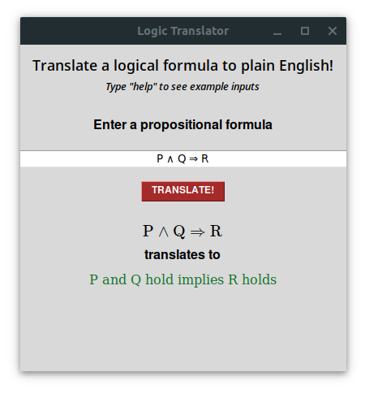
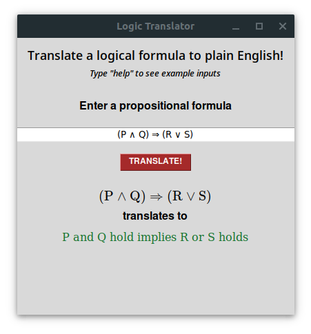
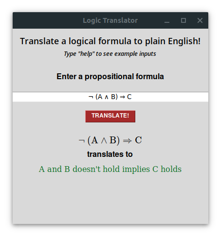
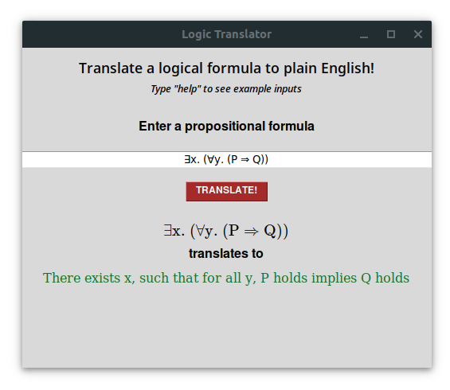

#Logic Translator

This is a simple tool to translate propositional logic to natural language.

**Example 1 -**  Translating an implication with a conjunctional antecedent. 

 

**Example 2 -**  Translating an implication with a conjunctional antecedent and disjunction for the consequent. 

 

**Example 3 -**  Translating a formula with negation. 

 

**Example 4 -**  Translating quantification. 

